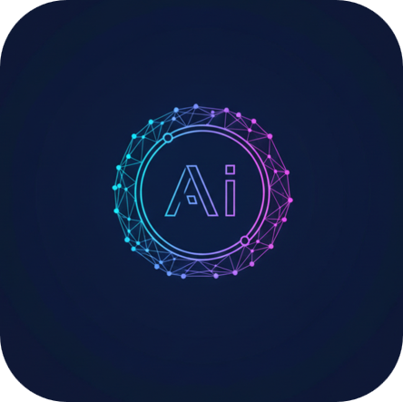

# AIStudy

  

## 📝 개요

**AIStudy** 프로젝트는 인공지능(AI) 학습 및 연구를 위한 코드 저장소입니다.  
다양한 AI 모델 구현, 데이터 전처리, 그리고 최신 머신러닝 알고리즘을 실험하고 공부한 내용을 기록합니다.  
이론적인 개념을 실제 **파이썬 코드**로 구현하며 실무 역량을 쌓는 것을 주요 목표로 합니다.

## ⚙️ 주요 학습 내용

이 프로젝트에서는 다음과 같은 핵심 AI 기술들을 다루고 구현합니다.

- **CNN (Convolutional Neural Networks)**
  - 이미지의 공간적 특징을 추출하는 합성곱 및 풀링 계층 학습.
  - 이미지 분류 및 객체 인식 예제 포함.
- **Emotion Detection (감정 인식)**
  - **MLP (Multi-Layer Perceptron):** 기본 신경망을 이용한 특징 기반 감정 분류.
  - **CNN (Convolutional Neural Networks):** 얼굴 이미지의 특징을 직접 추출하여 감정 상태 분석.
  - **MediaPipe + MLP:** MediaPipe Face Mesh를 활용해 랜드마크를 추출하고, 이를 MLP 모델의 입력값으로 사용하는 경량화 모델 구현.
- **RNN (Recurrent Neural Networks)**
  - 시계열 및 자연어 등 순차적 데이터(Sequential Data) 처리.
  - LSTM, GRU를 통한 장기 의존성 문제 해결 구조 이해.
- **LLM (Large Language Models)**
  - Transformer 아키텍처 및 Attention 메커니즘 연구.
  - 사전 학습(Pre-training) 및 미세 조정(Fine-tuning) 구현.
- **YOLO (You Only Look Once) & Custom Backbone**
  - 실시간 객체 탐지(Object Detection) 알고리즘 실습.
  - **Custom Model:** 특정 도메인 최적화를 위해 YOLO의 기본 백본을 **MobileNet** 등으로 교체하는 아키텍처 설계 및 구현 학습.

